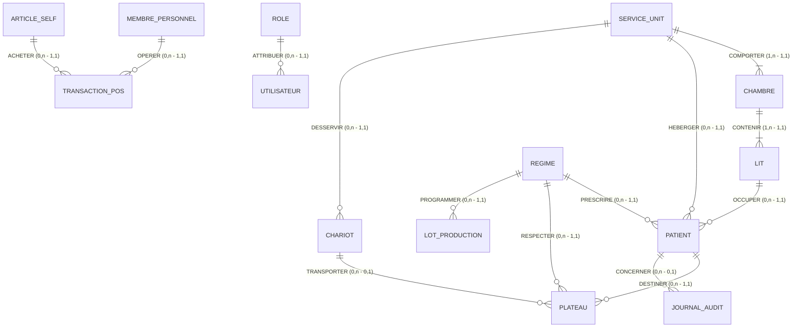

# CAHIER DES CHARGES COMPLET & DOSSIER DE CONCEPTION SYSTÈME
# SYSTÈME INTÉGRÉ DE RESTAURATION HOSPITALIÈRE, SÉCURITÉ ALIMENTAIRE & TRAÇABILITÉ CLINIQUE (HIS-CATERING)

---

# PARTIE 1 — PRÉSENTATION DU PROJET

### 1.1 Nom du Projet
**HIS-Catering** (*Hospital Information System — Catering, Clinical Nutrition & Anti-Fraud Security*).

### 1.2 Contexte
Dans les établissements de santé modernes (cliniques privées et centres hospitaliers), la restauration ne constitue pas une simple prestation hôtelière annexe : il s'agit d'un **acte thérapeutique à part entière**, indissociable de la sécurité des soins. Une erreur de plateau (distribution d'un repas normal à un patient diabétique ou sous régime sans sel strict, non-respect d'allergies sévères, ou pire, distribution d'un repas solide à un patient consigné « À JEUN » avant une anesthésie générale au bloc opératoire) engage directement le pronostic vital du patient et la responsabilité médico-légale de l'établissement.

Parallèlement, la restauration collective hospitalière fait face à des déperditions financières significatives : repas fantômes, fraudes à la distribution, absence de contrôle des rations du personnel, gaspillage et ruptures d'approvisionnement en matières premières.

### 1.3 Problématique
1. **Risque Médical Vital** : Absence de synchronisation instantanée entre la prescription médicale de jeûne opératoire et la chaîne de distribution des plateaux-repas.
2. **Vulnérabilité d'Identitovigilance** : Risque d'erreur de patient lors de la distribution en chambre en l'absence de vérification électronique automatisée au lit du malade.
3. **Pertes et Fraudes** : Discordance entre les matières premières achetées, les portions produites en cuisine centrale, les repas servis aux patients et les consommations des équipes médicales au self.
4. **Contraintes Réglementaires Lourdes** : Exigence absolue de respect du paquet hygiène et des normes HACCP (liaison chaude $\ge +63^\circ\text{C}$, liaison froide $\le +3^\circ\text{C}$, traçabilité des températures et conservation légale des plats témoins pendant 7 jours).

### 1.4 Objectifs Généraux
Concevoir et déployer une plateforme logicielle intégrée full-stack garantissant le **zéro défaut** dans la chaîne logistique alimentaire hospitalière, de l'économat jusqu'au lit du patient, tout en intégrant la gestion monétique de la cantine du personnel.

### 1.5 Objectifs Spécifiques
* **Boucle Fermée par QR Code Unique** : Génération d'étiquettes à QR Code cryptographique unique scellant chaque plateau-repas.
* **Sécurité « À Jeun » Instantanée** : Verrouillage informatique et physique immédiat de tout plateau destiné à un patient devant subir une intervention ou un examen.
* **Double Scan au Lit** : Procédure inviolable imposant la lecture conjointe du bracelet d'hospitalisation (IPP) et du plateau-repas via terminal mobile, avec contrôle de concordance en moins de 500 ms.
* **Traçabilité Sanitaire HACCP Continue** : Surveillance IoT des chambres froides, enregistrement horodaté des cuissons et gestion des plats témoins.
* **Caisse Self du Personnel (POS)** : Monétique sans contact par badge RFID avec gestion de solde prépayé et gratuité automatique des gardes de nuit.
* **Gestion des Stocks FEFO** : Réapprovisionnement automatique guidé par la date limite de 5consommation la plus courte (*First Expired, First Out*).

### 1.6 Public Cible et Utilisateurs
* Directions médicales, de la qualité et du contrôle de gestion.
* Équipes soignantes (infirmiers, aides-soignants, cadres de santé d'étage).
* Personnel de restauration collective (chef cuisinier, commis, économes, magasiniers).
* Personnel hospitalier utilisateur de la cantine (médecins, chirurgiens, soignants, administratifs).

### 1.7 Périmètre Fonctionnel
Le périmètre couvre 8 modules opérationnels :
1. Distribution & Pilotage des Plateaux
2. Confection, Menu du Jour & Répartition
3. Logistique des Chariots Isothermes & Frigos d'Urgence
4. Mobilité Soignante (Terminal de Double Scan au Lit)
5. Audit Anti-Fraude & Réconciliation en Temps Réel
6. Caisse Self & Monétique RFID Personnel (POS)
7. Économat, Niveaux de Stocks & Bons de Commande Automatisés
8. Contrôle Qualité Sanitaire & Normes HACCP

### 1.8 Périmètre Technique
* **Frontend** : Next.js 16 (App Router), React 19, TypeScript, Tailwind CSS, Moteur SVG QR Code autonome.
* **Backend** : Next.js API Routes RESTful et Server Actions (`"use server"`).
* **ORM** : Prisma ORM 7 avec typage strict de bout en bout.
* **Base de Données** : SQLite en développement local / PostgreSQL en environnement de production hébergé.

---

# PARTIE 2 — ANALYSE FONCTIONNELLE DÉTAILLÉE

### 2.1 Module 1 : Pilotage de la Distribution des Plateaux (`/distribution`)
* **Objectif** : Superviser l'assemblage, le conditionnement et la conformité diététique des plateaux-repas des patients hospitalisés.
* **Fonctionnalités** :
  * Affichage en temps réel des plateaux ordonnancés avec distinction des statuts (`PREPARATION`, `SCELLE_QR`, `A_JEUN_BLOQUE`, `PRET_DEPART`, `LIVRE_CONFORME`).
  * Filtrage multi-critères par unité de soin (Chirurgie, Médecine, Maternité) et par régime nutritionnel (Normal, Diabétique, Sans Sel, Mixé).
  * Génération dynamique d'étiquettes avec QR Code cryptographique unique (`qrEngine.ts`).
  * Fenêtre modale d'aperçu du plateau avec impression unitaire ou par lot.
  * Validation du changement d'état (« Prêt au départ »).
  * Réception et affichage prioritaire de la consigne d'urgence « À JEUN ».
* **Utilisateurs concernés** : Chef de cuisine, Responsable distribution, Cadre de santé.
* **Données manipulées** : `Tray`, `Patient`, `Diet`, `ServiceUnit`, `Bed`, `Room`.
* **Actions disponibles** : Consulter, Filtrer, Générer QR, Imprimer lot, Déclarer départ, Bloquer à jeun.
* **Entrées** : Sélections de filtres, clic d'action de changement de statut, ordre de mise à jeun.
* **Sorties** : Grille de cartes de plateaux, tableau tabulaire, aperçu visuel QR vectoriel SVG, flux d'impression.
* **Règles de gestion** : RG-DST-01, RG-DST-02, RG-DST-03, RG-BLC-01, RG-BLC-02, RG-BLC-03.
* **Dépendances** : Module Production, Module Mobilité, Module Logistique.

### 2.2 Module 2 : Menu du Jour, Confection & Répartition (`/production`)
* **Objectif** : Ordonnancer les fabrications culinaires journalières selon les effectifs réels des services hospitaliers.
* **Fonctionnalités** :
  * Calcul de la matrice des régimes diététiques croisant les unités de soin et les textures prescrites.
  * Affichage des menus planifiés (Entrée, Plat protéiné, Féculents, Laitage/Dessert).
  * Décompte prévisionnel des portions à confectionner avec heure limite de commande (cut-off à 10h00).
* **Utilisateurs concernés** : Chef cuisinier, Cuisiniers de partie, Diététicienne.
* **Données manipulées** : `ProductionRun`, `Diet`, `ServiceUnit`, `Patient`.
* **Actions disponibles** : Consulter la matrice, ajuster les volumes, valider la fin de cuisson.
* **Entrées** : Date du jour, service de repas (Déjeuner / Dîner).
* **Sorties** : Matrice de synthèse, bons de tirage de production.
* **Règles de gestion** : RG-PRD-01, RG-PRD-02.
* **Dépendances** : Module Distribution, Module Stocks.

### 2.3 Module 3 : Logistique des Chariots Isothermes & Frigos Relais (`/logistique`)
* **Objectif** : Maîtriser la chaîne logistique entre la cuisine centrale et les étages d'hospitalisation.
* **Fonctionnalités** :
  * Enregistrement des départs de chariots isothermes avec contrôle thermique systématique (Chaud $\ge +63^\circ\text{C}$, Froid $\le +3^\circ\text{C}$).
  * Scellé des chariots avec décompte des plateaux embarqués et signature numérique de l'opérateur.
  * Surveillance de l'état des frigos relais d'étage pour les dotations nocturnes d'urgence (post-20h00).
* **Utilisateurs concernés** : Agents logistiques, Chauffeurs/Brancardiers, Soignants de nuit.
* **Données manipulées** : `Cart`, `EmergencyFridge`, `ServiceUnit`, `Tray`.
* **Actions disponibles** : Nouveau départ de chariot, relevé de température chariot, déclaration de consommation frigo de nuit.
* **Entrées** : Code chariot, étage, température mesurée, identité agent.
* **Sorties** : Liste des chariots en tournée, indicateurs de conformité thermique, alertes réassort frigo.
* **Règles de gestion** : RG-LOG-01, RG-LOG-02, RG-LOG-03, RG-FRG-01, RG-FRG-02.
* **Dépendances** : Module Distribution, Module HACCP.

### 2.4 Module 4 : Mobilité Soignante — Double Scan au Lit (`/mobile`)
* **Objectif** : Sécuriser la remise effective du plateau-repas au chevet du patient hospitalisé.
* **Fonctionnalités** :
  * Étape 1 : Lecture optique du bracelet d'identification du patient (code-barres IPP).
  * Étape 2 : Lecture optique du QR Code apposé sur la cloche du plateau scellé.
  * Comparaison instantanée (< 500 ms) entre l'identité du patient, son lit, son régime et l'absence d'interdiction médicale.
  * Déclenchement d'alarme sonore et visuelle en cas de discordance ou de consigne « À Jeun ».
  * Horodatage certifié de la distribution réussie dans le journal d'audit.
* **Utilisateurs concernés** : Infirmiers, Aides-soignants.
* **Données manipulées** : `Patient`, `Tray`, `AuditLog`.
* **Actions disponibles** : Scanner bracelet, Scanner plateau, Déclencher simulation de fraude/discordance, Réinitialiser.
* **Entrées** : Données optiques code-barres et QR Code.
* **Sorties** : Bannière de conformité verte / Bannière d'alarme rouge, création d'une entrée `AuditLog`.
* **Règles de gestion** : RG-MOB-01, RG-MOB-02, RG-MOB-03, RG-MOB-04.
* **Dépendances** : Module Distribution, Module Antifraude.

### 2.5 Module 5 : Audit Anti-Fraude & Réconciliation en Temps Réel (`/antifraude`)
* **Objectif** : Détecter les anomalies, fraudes, retards et écarts de distribution dans tout l'établissement.
* **Fonctionnalités** :
  * Présentation des 5 piliers de sécurité de la clinique (QR unique, Scellé chariot, Double scan, Timeout 45 min, Audit journalier).
  * Consultation du registre inviolable des scans en temps réel.
  * Surveillance du délai limite de 45 minutes entre sortie de cuisine et remise au lit.
* **Utilisateurs concernés** : Direction générale, Direction des soins, Auditeurs qualité.
* **Données manipulées** : `AuditLog`, `Tray`, `Patient`.
* **Actions disponibles** : Consulter le journal, filtrer par résultat (Conforme / Alerte), exporter le registre d'audit.
* **Entrées** : Filtres de recherche chronologique.
* **Sorties** : Tableau d'audit certifié immuable, exports de conformité légale.
* **Règles de gestion** : RG-AUD-01, RG-AUD-02.
* **Dépendances** : Module Mobilité, Module Distribution.

### 2.6 Module 6 : Caisse Self & Restauration du Personnel — POS (`/pos`)
* **Objectif** : Gérer la restauration des collaborateurs hospitaliers via caisse tactile et badge sans contact.
* **Fonctionnalités** :
  * Identification instantanée de l'agent hospitalier par badge RFID (lecture matricule RH).
  * Affichage du solde prépayé avec gestion de découvert autorisé d'un repas (35,00 MAD).
  * Grille tactile de sélection des articles (formules complètes, plats chauds, salade bar, desserts, boissons).
  * Gratuité à 100% de la formule « Collation Garde Nuit » pour les équipes soignantes nocturnes.
  * Débit immédiat du compte avec historisation de la transaction.
  * Rechargement rapide du solde (+100, +200, +500 MAD) par CB, espèces ou retenue paie.
* **Utilisateurs concernés** : Caissier de la cantine, Salariés de la clinique.
* **Données manipulées** : `StaffMember`, `PosArticle`, `PosTransaction`.
* **Actions disponibles** : Sélectionner article, Débiter badge RFID, Recharger compte, Consulter historique.
* **Entrées** : Matricule lu, identifiant de l'article, montant de recharge.
* **Sorties** : Solde actualisé, notification toast, transaction enregistrée.
* **Règles de gestion** : RG-POS-01, RG-POS-02, RG-POS-03, RG-POS-04, RG-POS-05.
* **Dépendances** : Aucune dépendance critique avec les séjours patients.

### 2.7 Module 7 : Économat, Niveaux de Stocks & Réapprovisionnement (`/stocks`)
* **Objectif** : Garantir la disponibilité des denrées alimentaires indispensables tout en minimisant le gaspillage.
* **Fonctionnalités** :
  * Inventaire des stocks physiques avec suivi des Dates Limites de Consommation selon la règle FEFO.
  * Détection automatique des ruptures potentielles dès franchissement du seuil de sécurité.
  * Génération automatique de bons de commande fournisseurs (`PurchaseOrder`).
  * Validation et impression des bons de commande par l'économe avec passage au statut `TRANSMIS`.
  * Recherche plein-texte sur les denrées et export du fichier d'inventaire.
* **Utilisateurs concernés** : Économe, Responsable des achats, Magasinier.
* **Données manipulées** : `StockItem`, `PurchaseOrder`.
* **Actions disponibles** : Créer denrée, modifier stock, supprimer article, valider et imprimer bon de commande.
* **Entrées** : Paramètres de stock, formulaires de mise à jour, validation bon d'achat.
* **Sorties** : Alertes visuelles colorées, tableau des denrées, bons de commande imprimables.
* **Règles de gestion** : RG-STK-01, RG-STK-02, RG-STK-03, RG-STK-04.
* **Dépendances** : Module Production.

### 2.8 Module 8 : Contrôle Sanitaire & Normes HACCP (`/haccp`)
* **Objectif** : Assurer la conformité réglementaire absolue aux normes d'hygiène et de sécurité alimentaire.
* **Fonctionnalités** :
  * Télémétrie en continu des chambres froides positives (+2°C à +4°C) et négatives ($\le -18^\circ\text{C}$).
  * Registre des plats témoins prélevés sous scellé hermétique avec décompte légal des 7 jours de rétention.
  * Saisie et validation des contrôles de liaison chaude de cuisson ($\ge +63,0^\circ\text{C}$).
* **Utilisateurs concernés** : Responsable qualité hygiène, Chef cuisinier, Inspecteurs sanitaires.
* **Données manipulées** : `ColdRoom`, `SampleMeal`, `HotTempLog`.
* **Actions disponibles** : Enregistrer un relevé manuel chaud, vérifier les chambres froides, contrôler les scellés témoins.
* **Entrées** : Nom du plat/équipement, température mesurée.
* **Sorties** : Indicateurs de conformité verts/rouges, historique certifié des mesures.
* **Règles de gestion** : RG-HAC-01, RG-HAC-02, RG-HAC-03.
* **Dépendances** : Module Production, Module Logistique.

---

# PARTIE 3 — ACTEURS DU SYSTÈME

| Acteur | Description | Permissions Principales | Modules Accessibles |
| :--- | :--- | :--- | :--- |
| **Administrateur / Direction** | Direction Médicale, Directeur Financier et Responsable Système d'Information | Paramétrage global, accès aux indicateurs stratégiques, gestion des utilisateurs, inspection anti-fraude, audit financier des rendements. | Tous les modules (`/distribution`, `/production`, `/logistique`, `/mobile`, `/antifraude`, `/pos`, `/stocks`, `/haccp`). |
| **Chef de Cuisine / Économe** | Responsable de la cuisine centrale et de l'économat | Ordonnancement des repas, validation des départs chariots, gestion des denrées, émission des bons d'achat, contrôle HACCP. | `/distribution`, `/production`, `/logistique`, `/stocks`, `/haccp`. |
| **Soignant d'Étage / Infirmier** | Personnel médical et soignant en unité d'hospitalisation | Consignation urgente « À JEUN », réception des chariots, double scan au lit du patient (IPP + QR Plateau), consultation des régimes. | `/mobile`, `/distribution` (lecture & alerte à jeun), `/logistique` (frigos relais). |
| **Agent de Caisse / Self** | Opérateur de caisse du restaurant d'entreprise du personnel hospitalier | Débit de badge RFID, encaissement des recharges de porte-monnaie, consultation du catalogue des formules. | `/pos`. |
| **Responsable Qualité / HACCP** | Hygiéniste et diététicien(ne) clinique | Suivi des normes sanitaires, audit des plats témoins 7 jours, vérification des sondes IoT et des seuils thermiques. | `/haccp`, `/antifraude`, `/production`, `/distribution`. |
| **Magasinier / Réceptionnaire** | Gestionnaire physique des entrées et sorties en chambre froide et économat | Réception des denrées, pointage des livraisons fournisseurs, déstockage par recette, inventaire physique FEFO. | `/stocks`. |

---

# PARTIE 4 — CAS D'UTILISATION PRINCIPAUX

### 4.1 Tableau Récapitulatif des Cas d'Utilisation

| ID | Cas d'Utilisation | Acteur Principal | Module |
| :--- | :--- | :--- | :--- |
| **UC-01** | Ordonnancer et sceller un plateau-repas nominatif | Chef de Cuisine | Distribution |
| **UC-02** | Consigner un patient « À JEUN » en urgence | Soignant d'Étage | Distribution / Mobilité |
| **UC-03** | Valider le départ d'un chariot isotherme scellé | Chef de Cuisine / Logistique | Logistique |
| **UC-04** | Réaliser le double scan au lit du patient | Soignant d'Étage | Mobilité Soignante |
| **UC-05** | Débiter un repas sur badge RFID personnel | Agent de Caisse | Caisse POS |
| **UC-06** | Valider un bon de commande suite à alerte de stock | Économe / Magasinier | Stocks & Approvisionnement |
| **UC-07** | Enregistrer un contrôle de liaison chaude de cuisson | Chef de Cuisine / Hygiène | Contrôle HACCP |
| **UC-08** | Consulter le journal d'audit pour réconciliation anti-fraude | Direction / Qualité | Audit Anti-Fraude |

### 4.2 Description Détaillée des Cas d'Utilisation Critiques

#### UC-02 : Consigner un patient « À JEUN » en urgence
* **Acteur** : Soignant d'Étage (Infirmier, Médecin de bloc).
* **Préconditions** : Le patient est admis dans un service clinique et possède des plateaux en cours de préparation ou de distribution.
* **Déclencheur** : Décision chirurgicale d'intervention imminente ou examen médical nécessitant vacuité gastrique.
* **Scénario Principal** :
  1. Le soignant ouvre l'interface et sélectionne le patient concerné.
  2. Il clique sur « Consigner À Jeun » et indique le motif opératoire.
  3. Le système enregistre instantanément `Patient.isAJeun = true`.
  4. Le système identifie tous les plateaux non encore livrés de ce patient et bascule leur statut à `A_JEUN_BLOQUE` avec `isBlocked = true`.
  5. Une alerte visuelle et sonore prioritaire s'affiche sur tous les postes connectés (bandeau supérieur rouge).
  6. Le compteur de plateaux bloqués de la barre latérale s'incrémente.
  7. Un événement de sécurité certifié est inscrit dans le journal d'audit.
* **Exceptions** : Si le plateau a déjà fait l'objet d'un double scan conforme (`LIVRE_CONFORME`), le système avertit immédiatement le soignant que le repas a déjà été ingéré.
* **Résultat Attendu** : Aucun plateau n'est délivré au patient ; le risque d'inhalation bronchique sous anesthésie est neutralisé.

#### UC-04 : Réaliser le double scan au lit du patient
* **Acteur** : Soignant d'Étage (Infirmier).
* **Préconditions** : Le soignant se trouve physiquement dans la chambre avec le chariot isotherme et le plateau scellé.
* **Déclencheur** : Présentation du plateau au chevet du patient.
* **Scénario Principal** :
  1. Le soignant active le lecteur optique du terminal mobile et scanne le code-barres du bracelet du patient (IPP).
  2. Le terminal valide l'admission et affiche l'identité, le lit et le régime prescrit.
  3. Le soignant scanne le QR code scellant le couvercle du plateau-repas.
  4. L'application compare les jetons en moins de 500 ms (identité, lit, régime et statut « À Jeun »).
  5. Les données concordent parfaitement et le patient n'est pas à jeun.
  6. Le terminal émet un signal visuel vert et sonore de validation.
  7. Le plateau passe au statut `LIVRE_CONFORME`.
  8. L'horodatage, l'identité du soignant et la durée de validation sont archivés dans `AuditLog`.
* **Scénario Alternatif (Discordance)** :
  * Le plateau scanné ne correspond pas au patient scanné ou le patient est consigné « À Jeun ».
  * L'application déclenche une alarme stridente rouge et affiche le message bloquant d'interdiction de remise.
  * L'incident est archivé comme alerte de fraude / discordance dans `AuditLog`.
* **Résultat Attendu** : Garantie absolue de distribution du bon repas au bon patient.

---

# PARTIE 5 — ENTITÉS DE LA BASE DE DONNÉES

Le système est structuré autour de **20 entités conceptuelles**.

### 1. ROLE
* **Description** : Profil d'habilitation système.
* **Identifiant** : `id` (Identifiant)
* **Attributs** :

| Attribut | Type logique | Obligatoire | Description |
| :--- | :--- | :--- | :--- |
| `id` | Identifiant | Oui | Clé primaire unique |
| `name` | Texte | Oui | Nom mnémonique unique du rôle |
| `type` | Texte | Oui | Catégorie fonctionnelle |
| `createdAt` | DateHeure | Oui | Date de création |

### 2. USER
* **Description** : Compte d'accès des professionnels au logiciel.
* **Identifiant** : `id` (Identifiant)
* **Attributs** :

| Attribut | Type logique | Obligatoire | Description |
| :--- | :--- | :--- | :--- |
| `id` | Identifiant | Oui | Clé primaire unique |
| `name` | Texte | Oui | Nom et prénom |
| `email` | Texte | Oui | Email unique de connexion |
| `roleId` | Identifiant | Oui | Référence au rôle attribué |
| `createdAt` | DateHeure | Oui | Date de création |
| `updatedAt` | DateHeure | Oui | Date de mise à jour |

### 3. SERVICE_UNIT
* **Description** : Unité clinique d'hébergement (ex: Chirurgie, Médecine).
* **Identifiant** : `id` (Identifiant)
* **Attributs** :

| Attribut | Type logique | Obligatoire | Description |
| :--- | :--- | :--- | :--- |
| `id` | Identifiant | Oui | Clé primaire |
| `code` | Texte | Oui | Code unique (chirurgie, etc.) |
| `name` | Texte | Oui | Intitulé complet du service |
| `floor` | Texte | Oui | Étage d'implantation |

### 4. ROOM
* **Description** : Chambre d'hospitalisation rattachée à une unité de soin.
* **Identifiant** : `id` (Identifiant)
* **Attributs** : `id` (Identifiant, Obligatoire), `number` (Texte, Obligatoire), `serviceUnitId` (Identifiant, Obligatoire).

### 5. BED
* **Description** : Emplacement nominatif au sein d'une chambre (Lit A, B).
* **Identifiant** : `id` (Identifiant)
* **Attributs** : `id` (Identifiant, Obligatoire), `code` (Texte, Obligatoire), `roomId` (Identifiant, Obligatoire).

### 6. DIET
* **Description** : Prescription diététique médicale (Normal, Sans Sel, etc.).
* **Identifiant** : `id` (Identifiant)
* **Attributs** : `id` (Identifiant, Obligatoire), `code` (Texte, Obligatoire, Unique), `name` (Texte, Obligatoire), `texture` (Texte, Obligatoire), `description` (Texte, Facultatif).

### 7. PATIENT
* **Description** : Patient hospitalisé identifié par son numéro d'IPP.
* **Identifiant** : `id` (Identifiant)
* **Attributs** :

| Attribut | Type logique | Obligatoire | Description |
| :--- | :--- | :--- | :--- |
| `id` | Identifiant | Oui | Clé primaire |
| `ipp` | Texte | Oui | Identifiant Permanent Patient unique |
| `firstName` | Texte | Oui | Prénom du patient |
| `lastName` | Texte | Oui | Nom de famille |
| `serviceUnitId`| Identifiant | Oui | Service d'hospitalisation |
| `bedId` | Identifiant | Oui | Lit assigné |
| `dietId` | Identifiant | Oui | Régime alimentaire prescrit |
| `isAJeun` | Booléen | Oui | Indicateur d'interdiction de repas |
| `aJeunReason`| Texte | Non | Motif médical (Bloc, etc.) |
| `createdAt` | DateHeure | Oui | Date d'admission |
| `updatedAt` | DateHeure | Oui | Date de mise à jour |

### 8. TRAY
* **Description** : Plateau-repas sécurisé par QR Code unique.
* **Identifiant** : `id` (Identifiant)
* **Attributs** : `id` (Identifiant, Obligatoire), `patientId` (Identifiant, Obligatoire), `dietId` (Identifiant, Obligatoire), `cartId` (Identifiant, Facultatif), `qrToken` (Texte, Obligatoire, Unique), `status` (Enumération, Obligatoire), `mealService` (Texte, Obligatoire), `starter` (Texte, Facultatif), `mainCourse` (Texte, Facultatif), `sideDish` (Texte, Facultatif), `dessert` (Texte, Facultatif), `allergens` (Texte, Facultatif), `isExtraAccompagnant` (Booléen, Obligatoire), `extraDescription` (Texte, Facultatif), `isBlocked` (Booléen, Obligatoire), `createdAt` (DateHeure, Obligatoire), `updatedAt` (DateHeure, Obligatoire).

### 9. PRODUCTION_RUN
* **Description** : Lot de fabrication de repas en cuisine centrale.
* **Identifiant** : `id` (Identifiant)
* **Attributs** : `id` (Identifiant, Obligatoire), `code` (Texte, Obligatoire, Unique), `mealService` (Texte, Obligatoire), `dietId` (Identifiant, Obligatoire), `quantity` (Entier, Obligatoire), `status` (Enumération, Obligatoire), `productionDate` (DateHeure, Obligatoire), `createdAt` (DateHeure, Obligatoire), `updatedAt` (DateHeure, Obligatoire).

### 10. CART
* **Description** : Chariot isotherme de transport avec maintien thermique.
* **Identifiant** : `id` (Identifiant)
* **Attributs** : `id` (Identifiant, Obligatoire), `code` (Texte, Obligatoire, Unique), `serviceUnitId` (Identifiant, Obligatoire), `traysCount` (Entier, Obligatoire), `tempHot` (Décimal, Obligatoire), `tempCold` (Décimal, Obligatoire), `status` (Enumération, Obligatoire), `scannedBy` (Texte, Facultatif), `departureTime` (DateHeure, Facultatif), `createdAt` (DateHeure, Obligatoire), `updatedAt` (DateHeure, Obligatoire).

### 11. EMERGENCY_FRIDGE
* **Description** : Frigo relais d'étage pour collations d'admission nocturne.
* **Identifiant** : `id` (Identifiant)
* **Attributs** : `id` (Identifiant, Obligatoire), `name` (Texte, Obligatoire, Unique), `service` (Texte, Obligatoire), `capacityTrays` (Entier, Obligatoire), `capacitySnacks` (Entier, Obligatoire), `availableTrays` (Entier, Obligatoire), `lastConsumedAt` (DateHeure, Facultatif), `lastConsumedInfo` (Texte, Facultatif), `updatedAt` (DateHeure, Obligatoire).

### 12. AUDIT_LOG
* **Description** : Journal immuable de traçabilité des scans et détection anti-fraude.
* **Identifiant** : `id` (Identifiant)
* **Attributs** : `id` (Identifiant, Obligatoire), `timestamp` (DateHeure, Obligatoire), `patientId` (Identifiant, Facultatif), `patientName` (Texte, Obligatoire), `ipp` (Texte, Obligatoire), `location` (Texte, Obligatoire), `agentName` (Texte, Obligatoire), `mealType` (Texte, Obligatoire), `scanResult` (Texte, Obligatoire), `scanDuration` (Texte, Obligatoire), `status` (Texte, Obligatoire).

### 13. STAFF_MEMBER
* **Description** : Employé hospitalier bénéficiant de la cantine et identifié par badge RFID.
* **Identifiant** : `id` (Identifiant)
* **Attributs** : `id` (Identifiant, Obligatoire), `name` (Texte, Obligatoire), `role` (Texte, Obligatoire), `matricule` (Texte, Obligatoire, Unique), `balance` (Décimal, Obligatoire), `createdAt` (DateHeure, Obligatoire), `updatedAt` (DateHeure, Obligatoire).

### 14. POS_ARTICLE
* **Description** : Article ou formule de restauration du personnel.
* **Identifiant** : `id` (Identifiant)
* **Attributs** : `id` (Identifiant, Obligatoire), `name` (Texte, Obligatoire), `subtitle` (Texte, Obligatoire), `price` (Décimal, Obligatoire), `icon` (Texte, Obligatoire), `isNightShift` (Booléen, Obligatoire).

### 15. POS_TRANSACTION
* **Description** : Débit de repas ou rechargement de porte-monnaie sur caisse tactile.
* **Identifiant** : `id` (Identifiant)
* **Attributs** : `id` (Identifiant, Obligatoire), `reference` (Texte, Facultatif), `type` (Enumération, Obligatoire), `status` (Enumération, Obligatoire), `paymentMethod` (Texte, Obligatoire), `staffMemberId` (Identifiant, Obligatoire), `articleId` (Identifiant, Obligatoire), `amount` (Décimal, Obligatoire), `createdAt` (DateHeure, Obligatoire), `updatedAt` (DateHeure, Facultatif).

### 16. STOCK_ITEM
* **Description** : Denrée alimentaire stockée en économat.
* **Identifiant** : `id` (Identifiant)
* **Attributs** : `id` (Identifiant, Obligatoire), `name` (Texte, Obligatoire), `physicalStock` (Décimal, Obligatoire), `unit` (Texte, Obligatoire), `thresholdStock` (Décimal, Obligatoire), `dlc` (Date, Obligatoire), `statusAlert` (Texte, Obligatoire), `updatedAt` (DateHeure, Obligatoire).

### 17. PURCHASE_ORDER
* **Description** : Bon de commande fournisseur généré lors d'alerte de seuil.
* **Identifiant** : `id` (Identifiant)
* **Attributs** : `id` (Identifiant, Obligatoire), `code` (Texte, Obligatoire, Unique), `supplier` (Texte, Obligatoire), `itemDetails` (Texte, Obligatoire), `amount` (Décimal, Facultatif), `status` (Enumération, Obligatoire), `createdAt` (DateHeure, Obligatoire).

### 18. COLD_ROOM
* **Description** : Chambre froide sous monitorage thermique IoT continu.
* **Identifiant** : `id` (Identifiant)
* **Attributs** : `id` (Identifiant, Obligatoire), `name` (Texte, Obligatoire), `type` (Texte, Obligatoire), `temperature` (Décimal, Obligatoire), `normMin` (Décimal, Obligatoire), `normMax` (Décimal, Obligatoire), `lastCheckAt` (DateHeure, Obligatoire), `sensorType` (Texte, Obligatoire).

### 19. SAMPLE_MEAL
* **Description** : Plat témoin scellé conservé pendant 7 jours légaux.
* **Identifiant** : `id` (Identifiant)
* **Attributs** : `id` (Identifiant, Obligatoire), `mealService` (Texte, Obligatoire), `content` (Texte, Obligatoire), `sampledDate` (DateHeure, Obligatoire), `daysLeft` (Entier, Obligatoire), `isSealed` (Booléen, Obligatoire).

### 20. HOT_TEMP_LOG
* **Description** : Relevé de température en liaison chaude ($\ge +63^\circ\text{C}$).
* **Identifiant** : `id` (Identifiant)
* **Attributs** : `id` (Identifiant, Obligatoire), `dishOrDevice` (Texte, Obligatoire), `temperature` (Décimal, Obligatoire), `isCompliant` (Booléen, Obligatoire), `recordedAt` (DateHeure, Obligatoire).

---

# PARTIE 6 — DICTIONNAIRE DE DONNÉES CONCEPTUEL

*(Consulter également le document dédié `DICTIONNAIRE_DONNEES.md` pour l'inventaire tabulaire complet des 110 attributs).*

Extrait synthétique représentatif du typage logique pur :

| Entité | Attribut | Description | Type logique | Taille | Null | Unique | PK | FK |
| :--- | :--- | :--- | :--- | :--- | :--- | :--- | :--- | :--- |
| **PATIENT** | id | Clé primaire | Identifiant | 36 | Non | Oui | Oui | Non |
| **PATIENT** | ipp | Identifiant Permanent Patient | Texte | 30 | Non | Oui | Non | Non |
| **PATIENT** | isAJeun | Indicateur médical mise à jeun | Booléen | - | Non | Non | Non | Non |
| **TRAY** | qrToken | Jeton cryptographique scellé | Texte | 50 | Non | Oui | Non | Non |
| **TRAY** | status | Statut dans la chaîne logistique | Enumération | 30 | Non | Non | Non | Non |
| **CART** | tempHot | Température compartiment chaud | Décimal | - | Non | Non | Non | Non |
| **STAFF_MEMBER**| balance | Solde porte-monnaie (MAD) | Décimal | - | Non | Non | Non | Non |
| **STOCK_ITEM** | physicalStock| Stock physique disponible | Décimal | - | Non | Non | Non | Non |
| **HOT_TEMP_LOG**| temperature | Mesure liaison chaude (°C) | Décimal | - | Non | Non | Non | Non |

---

# PARTIE 7 — RÈGLES DE GESTION MÉTIER

*(Consulter le document exhaustif `REGLES_GESTION.md` recensant l'intégralité des 37 règles métier classifiées par domaine).*

Principales règles structurantes :
* **RG-BLC-01** : Toute mise « À JEUN » d'un patient bloque automatiquement tous ses plateaux non livrés (`isBlocked = true`).
* **RG-MOB-01** : La distribution au lit exige la validation conjointe par double scan (Bracelet IPP + QR Plateau).
* **RG-LOG-01** : Liaison chaude obligatoire $\ge +63^\circ\text{C}$ au départ de tout chariot isotherme.
* **RG-HAC-02** : Prélèvement et conservation obligatoire d'un plat témoin pendant 7 jours francs.
* **RG-POS-03** : Découvert exceptionnel autorisé d'un montant maximal d'un repas (35,00 MAD) pour le personnel soignant.
* **RG-STK-02** : Franchissement de seuil d'alerte denrée $\rightarrow$ génération automatique d'un bon d'achat fournisseur.

---

# PARTIE 8 & 9 — MODÈLE CONCEPTUEL DE DONNÉES (MCD) & DIAGRAMME

Le modèle conceptuel applique strictement la méthode MERISE : indépendance du SGBD, associations sémantiques et cardinalités `(min, max)`.
*(Se référer au document `MCD.md` pour le diagramme visuel complet).*

---

# PARTIE 10 & 11 — MODÈLE LOGIQUE DE DONNÉES (MLD) & RÈGLES DE PASSAGE

*(Consulter le document dédié `MLD.md` pour le détail des clés et des dépendances).*

Formalisme relationnel avec `#` (Clé primaire) et `*` (Clé étrangère) :
* `ROLE(#id, name, type, createdAt)`
* `USER(#id, name, email, roleId*, createdAt, updatedAt)`
* `SERVICE_UNIT(#id, code, name, floor)`
* `ROOM(#id, number, serviceUnitId*)`
* `BED(#id, code, roomId*)`
* `DIET(#id, code, name, texture, description)`
* `PATIENT(#id, ipp, firstName, lastName, serviceUnitId*, bedId*, dietId*, isAJeun, aJeunReason, createdAt, updatedAt)`
* `TRAY(#id, patientId*, dietId*, cartId*, qrToken, status, mealService, starter, mainCourse, sideDish, dessert, allergens, isExtraAccompagnant, extraDescription, isBlocked, createdAt, updatedAt)`
* `PRODUCTION_RUN(#id, code, mealService, dietId*, quantity, status, productionDate, createdAt, updatedAt)`
* `CART(#id, code, serviceUnitId*, traysCount, tempHot, tempCold, status, scannedBy, departureTime, createdAt, updatedAt)`
* `EMERGENCY_FRIDGE(#id, name, service, capacityTrays, capacitySnacks, availableTrays, lastConsumedAt, lastConsumedInfo, updatedAt)`
* `AUDIT_LOG(#id, timestamp, patientId*, patientName, ipp, location, agentName, mealType, scanResult, scanDuration, status)`
* `STAFF_MEMBER(#id, name, role, matricule, balance, createdAt, updatedAt)`
* `POS_ARTICLE(#id, name, subtitle, price, icon, isNightShift)`
* `POS_TRANSACTION(#id, reference, type, status, paymentMethod, staffMemberId*, articleId*, amount, createdAt, updatedAt)`
* `STOCK_ITEM(#id, name, physicalStock, unit, thresholdStock, dlc, statusAlert, updatedAt)`
* `PURCHASE_ORDER(#id, code, supplier, itemDetails, amount, status, createdAt)`
* `COLD_ROOM(#id, name, type, temperature, normMin, normMax, lastCheckAt, sensorType)`
* `SAMPLE_MEAL(#id, mealService, content, sampledDate, daysLeft, isSealed)`
* `HOT_TEMP_LOG(#id, dishOrDevice, temperature, isCompliant, recordedAt)`

---

# PARTIE 12 — CORRESPONDANCE DU MODÈLE PHYSIQUE (PRISMA)

| Concept MLD | Implémentation Prisma ORM | Exemple dans le Projet |
| :--- | :--- | :--- |
| **Clé Primaire (PK)** | `@id @default(cuid())` | `id String @id @default(cuid())` |
| **Clé Étrangère (FK)** | `fieldName String` + `@relation(fields: [...], references: [id])` | `patient Patient @relation(fields: [patientId], references: [id])` |
| **Contrainte d'Unicité**| `@unique` | `ipp String @unique` |
| **Relation 1,N** | Tableau d'objets côté 1, lien `@relation` côté N | `trays Tray[]` dans `Patient` |
| **Relation 0,1 (Nullable)**| Champ optionnel `String?` | `cartId String?` dans `Tray` |
| **Horodatage Automatique**| `@default(now())` / `@updatedAt` | `createdAt DateTime @default(now())` |
| **Types Logiques** | Types natifs Prisma (`String`, `Int`, `Float`, `Boolean`, `DateTime`) | `balance Float`, `isAJeun Boolean` |

---

# PARTIE 13 — CONFORMITÉ DU SCHÉMA PRISMA EXISTANT

| Entité | MCD | MLD | Prisma | Statut | Observations |
| :--- | :---: | :---: | :---: | :---: | :--- |
| **`Role`** | Oui | Oui | Présent | **Conforme** | Schéma exact avec `@unique` sur `name`. |
| **`User`** | Oui | Oui | Présent | **Conforme** | Relation stricte avec `Role`. |
| **`ServiceUnit`** | Oui | Oui | Présent | **Conforme** | Code unique et navigation vers chambres et lits. |
| **`Room`** | Oui | Oui | Présent | **Conforme** | Clé étrangère vers `ServiceUnit`. |
| **`Bed`** | Oui | Oui | Présent | **Conforme** | Clé étrangère vers `Room`. |
| **`Diet`** | Oui | Oui | Présent | **Conforme** | Code unique, liaisons avec patients et plateaux. |
| **`Patient`** | Oui | Oui | Présent | **Conforme** | Attributs `isAJeun` et `aJeunReason` conformes aux règles de sécurité. |
| **`Tray`** | Oui | Oui | Présent | **Conforme** | Clé `qrToken` unique et lien optionnel `cartId`. |
| **`ProductionRun`** | Oui | Oui | Présent | **Conforme** | Lien vers `Diet` et ordonnancement par créneau. |
| **`Cart`** | Oui | Oui | Présent | **Conforme** | Gestion des températures chaud et froid. |
| **`EmergencyFridge`**| Oui | Oui | Présent | **Conforme** | Suivi des capacités et consommations de nuit. |
| **`AuditLog`** | Oui | Oui | Présent | **Conforme** | Dénormalisation contrôlée pour archivage légal. |
| **`StaffMember`** | Oui | Oui | Présent | **Conforme** | Matricule unique pour badge RFID. |
| **`PosArticle`** | Oui | Oui | Présent | **Conforme** | Gestion du tarif nuit à 0 MAD. |
| **`PosTransaction`** | Oui | Oui | Présent | **Conforme** | Double clé étrangère vers `StaffMember` et `PosArticle`. |
| **`StockItem`** | Oui | Oui | Présent | **Conforme** | Prise en compte du seuil de sécurité et DLC. |
| **`PurchaseOrder`** | Oui | Oui | Présent | **Conforme** | Bons d'achat avec statuts d'approvisionnement. |
| **`ColdRoom`** | Oui | Oui | Présent | **Conforme** | Normes min/max et liaison sonde IoT. |
| **`SampleMeal`** | Oui | Oui | Présent | **Conforme** | Conservation 7 jours et scellé hermétique. |
| **`HotTempLog`** | Oui | Oui | Présent | **Conforme** | Contrôle de conformité sanitaire $\ge +63^\circ\text{C}$. |

> **Conclusion de l'audit Prisma** : Le schéma `prisma/schema.prisma` du projet est **100% conforme** aux exigences conceptuelles et logiques MERISE. Aucune modification destructive n'est requise.

---

# PARTIE 14 — MATRICE DES DROITS CRUD

*(Se référer au document dédié `MATRICE_CRUD.md` pour l'analyse complète).*

Synthèse des privilèges par profil clé :
* **ADMIN** : CRUD complet sur toutes les entités de structure et lecture sur les journaux d'audit.
* **CHEF** : CRUD sur `Tray`, `ProductionRun`, `StockItem`, `PurchaseOrder`, et validation des départs `Cart`.
* **SOIGNANT** : Droit prioritaire d'actualisation de la mise à jeun (`Patient.isAJeun`) et création d'événements de certification au lit (`AuditLog`).
* **CAISSE** : Droit de création de transactions (`PosTransaction`) et mise à jour des soldes de badges (`StaffMember`).
* **QUALITE** : CRUD sur les contrôles sanitaires (`ColdRoom`, `SampleMeal`, `HotTempLog`) et audit permanent.

---

# PARTIE 15 — API, ROUTES & CONTRÔLEURS DE FLUX

| Méthode | Endpoint | Fonction Métier | Entités Manipulées | Authentification / Rôle |
| :--- | :--- | :--- | :--- | :--- |
| **GET** | `/api/distribution` | Récupère tous les plateaux, patients et statistiques | `Tray`, `Patient`, `Diet` | Session active (Chef / Soignant) |
| **POST** | `/api/distribution` | `action: CREATE` (Créer plateau) / `TRIGGER_A_JEUN` / `UPDATE_STATUS` | `Tray`, `Patient`, `AuditLog` | Soignant (A Jeun) / Chef (Création) |
| **GET** | `/api/stocks` | Consultation des stocks et bons de commande | `StockItem`, `PurchaseOrder` | Économe / Magasinier |
| **POST** | `/api/stocks` | `CREATE_STOCK`, `UPDATE_STOCK`, `TRANSMIT_ORDER` | `StockItem`, `PurchaseOrder` | Économe / Magasinier |
| **GET** | `/api/pos` | Récupération profil employé RFID et articles cantine | `StaffMember`, `PosArticle` | Agent de Caisse / Personnel |
| **POST** | `/api/pos` | `RECHARGE` (+100, +200, +500) ou `DEBIT` (achat repas) | `StaffMember`, `PosTransaction` | Agent de Caisse |
| **GET** | `/api/haccp` | Consultation températures chambres froides et plats témoins | `ColdRoom`, `SampleMeal`, `HotTempLog` | Qualité / Chef |
| **POST** | `/api/haccp` | Enregistrement de relevé de température manuelle chaude | `HotTempLog` | Cuisinier / Qualité |
| **GET** | `/api/logistique` | Consultation chariots isothermes et frigos d'étage | `Cart`, `EmergencyFridge` | Logistique / Soignant |
| **POST** | `/api/logistique` | Déclaration d'un départ de chariot scellé | `Cart` | Logistique / Chef |
| **GET** | `/api/antifraude` | Consultation du registre d'audit des distributions | `AuditLog` | Direction / Qualité |
| **POST** | `/api/antifraude` | Enregistrement certifié d'un événement de double scan | `AuditLog` | Terminal Mobile Soignant |

---

# PARTIE 16 — ARCHITECTURE TECHNIQUE & INTÉGRATIONS

*(Se référer au document dédié `ARCHITECTURE.md` pour les diagrammes de flux et d'intégration matérielle).*

* **Architecture logicielle** : Modèle 4 tiers structuré (Client React 19 $\rightarrow$ Next.js App Router $\rightarrow$ Prisma Client $\rightarrow$ Base relationnelle).
* **Intégration Matérielle** :
  * Lecteurs code-barres USB/HID pour bracelets d'admission IPP.
  * Caméras et terminaux optiques pour décryptage de matrices QR Code vectorielles.
  * Lecteurs de badges RFID 13.56 MHz (Mifare / Desfire) pour paiement sans contact en caisse.
  * Télémétrie de sondes IoT radio pour chambres froides.
* **Exports & Impressions** :
  * Export XLSX / CSV avec UTF-8 BOM (`\uFEFF`) pour intégration ERP comptable.
  * Impression thermique directe au format étiquette d'assiette 100x60mm.

---

# PARTIE 17 — FLUX FONCTIONNELS MAÎTRES

1. **Flux de Sécurité Patient** : Admission $\rightarrow$ Attribution lit et régime $\rightarrow$ Confection plateau $\rightarrow$ Scellé QR $\rightarrow$ Transport chariot $\rightarrow$ Double scan au lit $\rightarrow$ Validation conforme dans journal d'audit.
2. **Flux d'Urgence Médicale** : Consigne bloc opératoire $\rightarrow$ Bascule `isAJeun` $\rightarrow$ Blocage immédiat `A_JEUN_BLOQUE` $\rightarrow$ Alarme visuelle et sonore $\rightarrow$ Interdiction absolue de remise.
3. **Flux Monétique Cantine** : Présentation badge RFID $\rightarrow$ Lecture matricule $\rightarrow$ Vérification solde prépayé $\rightarrow$ Débit transaction atomique $\rightarrow$ Délivrance ticket.
4. **Flux Réapprovisionnement FEFO** : Déstockage recette $\rightarrow$ Franchissement seuil de sécurité $\rightarrow$ Génération automatique Bon de Commande $\rightarrow$ Validation et transmission fournisseur.
5. **Flux Sanitaire HACCP** : Télémesure chambres froides $\rightarrow$ Contrôle cuisson $\ge +63^\circ\text{C}$ $\rightarrow$ Mise sous scellé plat témoin 7 jours.

---

# PARTIE 18 — CONTRAINTES ET VALIDATIONS APPLICATIVES

* **Champs Obligatoires** : Aucun enregistrement de plateau ne peut être validé sans patient, régime, service de repas et jeton QR code unique.
* **Unicité Stricte** : L'IPP patient, le jeton QR code plateau, le matricule RFID employé, et le code bon de commande doivent être strictement uniques en base.
* **Contrôles Numériques & Décimaux** : Les stocks physiques et seuils doivent être des nombres positifs ou nuls ($\ge 0$). Les montants de caisse doivent être positifs.
* **Sécurité des Températures** : Tout relevé de liaison chaude inférieur à $+63,0^\circ\text{C}$ est automatiquement signalé non conforme (`isCompliant = false`) et déclenche un avertissement immédiat.
* **Confirmation d'Action Destructrice** : Toute suppression d'article en stock ou annulation de bon de commande requiert confirmation explicite de l'utilisateur.

---

# PARTIE 19 — SÉCURITÉ & CONFORMITÉ MÉDICO-LÉGALE

1. **Cloisonnement des Profils (RBAC)** : Séparation stricte des compétences entre le personnel médical, les cuisiniers et les agents de caisse.
2. **Jeton Cryptographique Anti-Rejeu** : Chaque étiquette de plateau possède un jeton unique ; la réimpression annule l'ancien jeton, interdisant le service d'un repas dupliqué.
3. **Journal d'Audit Immuable (WORM - *Write Once, Read Many*)** : Les enregistrements de la table `AuditLog` ne peuvent être ni altérés ni supprimés, constituant une preuve médico-légale recevable en cas de litige hospitalier.
4. **Protection contre les Injections** : Utilisation exclusive de requêtes paramétrées via Prisma ORM éliminant tout risque d'injection SQL.
5. **Désinfection des Entrées (XSS)** : Rendu React natif avec échappement systématique des données textuelles.

---

# PARTIE 20 — RAPPORT D'ANALYSE DES INCOHÉRENCES DU PROJET

L'audit approfondi du code source existant a permis de classifier les points d'amélioration :

### Problème 1 [CRITIQUE] : Données simulées dans les composants UI
* **Localisation** : `src/app/distribution/page.tsx` (tableau `trayList` statique en dur), `src/app/production/page.tsx` (HTML statique sans calcul dynamique).
* **Cause** : Projet initialement maquetté pour démonstration visuelle sans liaison complète aux routes API.
* **Impact** : Les modifications de statut et les créations de plateaux en base de données ne sont pas reflétées dynamiquement sur tous les écrans.
* **Solution Recommandée** : Remplacer l'état statique local par des appels aux API existantes (`/api/distribution`, `/api/production`) ou des Server Actions Next.js réactives.

### Problème 2 [IMPORTANT] : ToastContext créé mais non injecté dans le Layout racine
* **Localisation** : `src/app/layout.tsx`.
* **Cause** : Les composants `ToastContext.tsx` et `ToastContainer.tsx` ont été développés mais `<ToastContainer />` n'est pas instancié dans le fichier `layout.tsx`.
* **Impact** : Les notifications visuelles d'action réussie ou d'erreur système ne s'affichent pas dans l'interface globale.
* **Solution Recommandée** : Envelopper l'arborescence des composants dans `layout.tsx` avec le `ToastProvider` et insérer la balise `<ToastContainer />`.

### Problème 3 [MOYEN] : Interaction par `prompt()` et `alert()` bloquants
* **Localisation** : `src/app/haccp/page.tsx`, `src/app/stocks/page.tsx`, `src/app/distribution/page.tsx`.
* **Cause** : Utilisation de boîtes de dialogue JavaScript natives du navigateur pour les saisies de température et confirmations de validation.
* **Impact** : Expérience utilisateur dégradée sur tablette tactile médicale et risque de blocage du thread principal d'affichage.
* **Solution Recommandée** : Remplacer les `prompt()` et `alert()` par des composants de formulaires modaux intégrés au design Tailwind CSS.

### Problème 4 [FAIBLE] : Dépendance `qrcode` installée mais non exploitée
* **Localisation** : `package.json`.
* **Cause** : Le projet intègre un moteur autonome remarquable `src/lib/qrEngine.ts` développé en TypeScript pur, rendant superflue la dépendance externe `qrcode`.
* **Impact** : Légère surcharge de l'arborescence `node_modules` sans impact sur l'exécution.
* **Solution Recommandée** : Conserver le moteur interne `qrEngine.ts` qui est plus rapide, sans dépendance tierce et totalement vectoriel.

---

# PARTIE 21 — RECOMMANDATIONS TECHNIQUES D'EXÉCUTION

1. **Conserver 100% de la Maquette Visuelle** : Ne modifier aucune classe Tailwind CSS, aucun espacement, aucune icône ni couleur de la charte graphique médicale existante.
2. **Transition vers les Server Actions Next.js** : Utiliser les Server Actions `"use server"` pour les mutations de données (création de plateau, changement de statut, recharge de caisse) afin de bénéficier du rafraîchissement automatique du cache Next.js (`revalidatePath`).
3. **Migration Transparente SQLite $\leftrightarrow$ PostgreSQL** :
   * En local : conserver SQLite (`DATABASE_URL="file:./dev.db"`) pour une exécution immédiate sans dépendance externe.
   * En production Vercel : basculer le provider sur `postgresql` dans `schema.prisma` avec la chaîne de connexion distante.
4. **Seed Automatisé Réaliste** : Disposer d'un fichier `prisma/seed.ts` injectant le jeu d'essai clinique complet (3 services, 4 lits, 4 patients, 6 articles de cantine, chambres froides et stocks).

---

# PARTIE 22 — NORMALISATION RELATIONNELLE (1FN, 2FN, 3FN)

* **1FN (Première Forme Normale)** : Validée. Chaque attribut représente une valeur élémentaire indivisible. Les clés primaires identifient rigoureusement chaque ligne.
* **2FN (Deuxième Forme Normale)** : Validée. Toutes les clés primaires étant composées d'un identifiant atomique unique (`id`), aucune dépendance partielle n'est mathématiquement possible.
* **3FN (Troisième Forme Normale)** : Validée avec exception contrôlée. Aucune dépendance transitive n'existe entre attributs non-clés, à l'exception du journal d'audit (`AuditLog`) où la dénormalisation de l'identité du patient et de sa chambre est **volontaire et requise par les normes médico-légales** pour archiver une photographie exacte de l'événement lors du scan.

---

# PARTIE 23 — RÉSUMÉ FINAL DU SYSTÈME

### Synthèse Chiffrée de la Conception
1. **Nombre d'acteurs du système** : 6 profils clairement définis (Admin, Chef, Soignant, Caisse, Qualité, Magasinier).
2. **Nombre de modules fonctionnels** : 8 modules opérationnels dédiés.
3. **Nombre d'entités conceptuelles (MCD)** : 20 entités réparties sur 6 domaines hospitaliers.
4. **Nombre d'associations conceptuelles** : 14 associations formelles avec cardinalités Merise.
5. **Nombre de tables logiques (MLD)** : 20 tables relationnelles normalisées.
6. **Nombre de modèles Prisma ORM** : 20 modèles Prisma parfaitement synchronisés avec le MLD.
7. **Principales relations structurelles** : `ServiceUnit` $\rightarrow$ `Room` $\rightarrow$ `Bed` $\rightarrow$ `Patient` $\rightarrow$ `Tray` $\rightarrow$ `Cart`.
8. **Principales règles métier** : Verrouillage immédiat « À Jeun », Double Scan inviolable au lit, Liaison chaude $\ge +63^\circ\text{C}$, Conservation plat témoin 7 jours, Découvert caisse autorisé 35 MAD, Approvisionnement automatique FEFO.
9. **Principaux problèmes détectés** : Données statiques résiduelles dans 2 pages, `ToastContainer` à activer dans le layout, boîtes `alert()` à moderniser.
10. **Recommandations prioritaires** : Raccorder les composants de distribution et de stocks aux Server Actions Prisma sans toucher à la maquette graphique.

---

# VALIDATION DE CONFORMITÉ FINALE

* [x] Toutes les pages du projet analysées (`/distribution`, `/production`, `/logistique`, `/mobile`, `/antifraude`, `/pos`, `/stocks`, `/haccp`)
* [x] Tous les modules fonctionnels documentés
* [x] Tous les acteurs et profils identifiés avec matrice CRUD
* [x] Les 20 entités conceptuelles analysées et répertoriées
* [x] Dictionnaire de données complet avec typage conceptuel pur
* [x] Référentiel des règles de gestion métier établi
* [x] MCD MERISE élaboré avec diagramme Mermaid et explications des cardinalités
* [x] MLD relationnel formalisé avec `#` (PK) et `*` (FK)
* [x] Règles de passage MCD $\rightarrow$ MLD explicitées
* [x] Correspondance MLD $\rightarrow$ Schéma physique Prisma vérifiée
* [x] Architecture logicielle en couches et flux de données décrits
* [x] Matrice CRUD des acteurs et entités établie
* [x] Rapport d'audit des incohérences rédigé avec solutions
* [x] Formes normales 1FN, 2FN, 3FN validées
* [x] Intégrité du code source préservée (aucune modification destructive)
